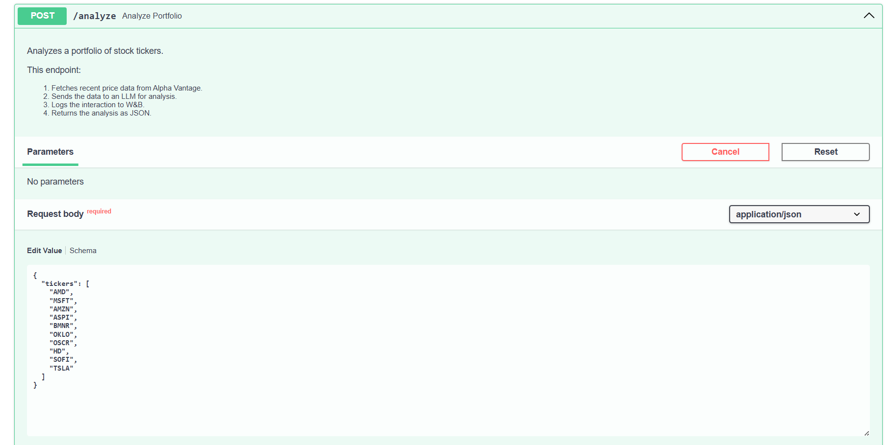
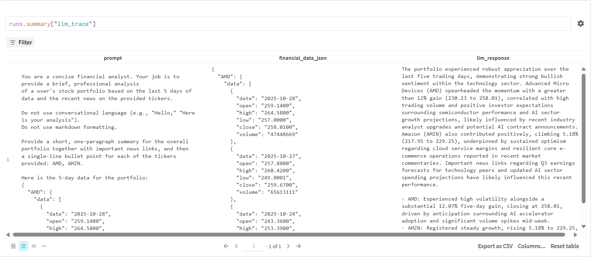

🤖 AI Portfolio Guard

A production-ready API that analyzes stock portfolios using real-time financial data and generative AI, complete with MLOps tracking and containerization.

This project is an end-to-end machine learning application that:

Accepts a list of stock tickers (e.g., ["MSFT", "GOOG"]) via a REST API.

Fetches the latest 5-day stock data from the Alpha Vantage API.

Sends this financial data to the Google Gemini API for a detailed, human-like analysis.

Logs the entire interaction (data, prompt, and LLM response) to Weights & Biases (W&B) for MLOps tracking and debugging.

Returns the AI-generated analysis to the user as a JSON response.

The entire application is containerized with Docker for complete reproducibility and is ready for cloud deployment.

Next steps: Use news from Alpha Vantage API to make more informed comments on the portfolio.

🚀 How to Run Locally

This project is built with Docker and can be run in two simple commands.

Prerequisites:

Docker Desktop installed and running.

Git installed.

1. Clone the Repository
```
git clone [https://github.com/atalay1/my_portfolio_analyzer.git](https://github.com/atalay1/my_portfolio_analyzer.git)
cd my_portfolio_analyzer
```

2. Create Your Secret Keys (.env file)

This project requires three API keys, copy the example file:
```
cp .env.example .env
```

Edit the .env file and add your secret keys.
```
ALPHA_VANTAGE_API_KEY="your_key_here"
GEMINI_API_KEY="your_key_here"
WANDB_API_KEY="your_key_here"
```

3. Build the Docker Image

This command builds the container, installing all dependencies from the Dockerfile.
```
docker build -t portfolio-analyzer .
```

4. Run the Container

This command runs the container and securely passes in your secret keys from the .env file.
```
docker run -p 8000:8000 \
  --env-file ./.env \
  --name portfolio-api \
  -d portfolio-analyzer
```

🔬 How to Use the API

The API is now running on your machine at:

http://localhost:8000/docs

From here, you can test the /analyze endpoint directly in your browser.

FastAPI Screen




📈 MLOps & Experiment Tracking

A key feature of this "production-ready" project is that every single API call is tracked using Weights & Biases.

This allows us to monitor and debug our LLM prompts and responses in real-time. We log a W&B Table for each analysis, capturing the input data, the exact prompt, and the model's response.

Example W&B Dashboard


